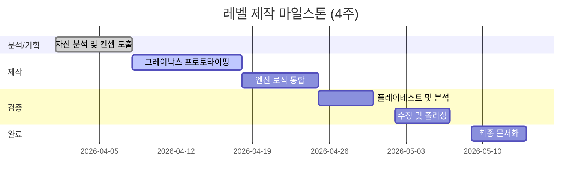

# 1. 해야할 것

1. 게임산업 뉴스 읽기 
2. 개인 공부

# 2. 오늘 배운 것

접기/펼치기

---

## 🎮 표준 모듈 기반 레벨 제작 가이드라인

표준화된 프랍과 액션-퍼즐 모듈을 활용하여 효율적이고 완성도 높은 레벨을 제작하기 위한 통합 프로세스입니다.

---

### 1. 전체 프로세스 로드맵
레벨 제작은 단방향이 아닌, **테스트와 수정이 반복되는 순환 구조**를 가집니다.

1.  **자산 분석**: 가용 프랍(장애물, 기믹, 트랩) 분류 및 성능 검토
2.  **목표 정의**: 타겟 유저 경험(UX) 및 난이도 곡선(85% 성공률 목표) 설계
3.  **콘셉트 구상**: 핵심 메커닉 조합 및 3막 구조(도입-전개-절정) 스케치
4.  **프로토타이핑**: 페이퍼 스케치 → 그레이박스(ProBuilder 등) → 엔진 통합
5.  **플레이테스트**: 정량(실패율, 시간) 및 정성 데이터 수집
6.  **폴리싱**: 텔레그래핑(예고), 페이싱 조정 및 버그 수정
7.  **최종 문서화**: LDD(레벨 디자인 문서) 및 튜닝 파라미터 정리

---

### 2. 핵심 설계 전략

#### 📍 모듈식 설계 및 최적화
* **Prefab 활용**: 모든 프랍은 프리팹화하여 유지보수 효율을 극대화합니다.
* **규격 통일**: 모듈의 피봇(Pivot)과 접속부(Grid) 규격을 통일하여 조립식 배치를 지원합니다.
* **성능 관리**: 동일 프랍 재사용으로 메모리를 절약하고, 복잡한 메시는 단순 콜라이더로 대체합니다.

#### 📈 난이도 및 학습 설계
* **15%의 법칙**: 플레이어가 약 15% 정도의 실패를 경험할 때 가장 높은 몰입감을 느낍니다.
* **단계적 학습**: `기본 메커닉 소개` → `변형 응용` → `복합 도전` 순으로 배치합니다.
* **텔레그래핑**: 위험 요소(예: 떨어지는 발판) 전에는 반드시 시각적·청각적 전조 증상을 제공합니다.

---

### 3. 실무 문서화 템플릿 (산출물)

효율적인 협업을 위해 다음 문서들을 단계별로 작성합니다.

| 단계 | 주요 문서 | 핵심 내용 |
| :--- | :--- | :--- |
| **기획** | **레벨 디자인 문서 (LDD)** | 목표 경험, 난이도 곡선, 프랍 리스트 |
| **설계** | **인카운터 맵** | 적/기믹 배치도, 순찰 경로, 플레이어 동선 |
| **로직** | **이벤트 플로우차트** | 스위치-문 연동 등 메커닉 작동 논리 |
| **검증** | **테스트 결과 보고서** | 구간별 사망 횟수, 이탈 지점, 유저 피드백 |
| **조정** | **밸런스 시트** | 이동 속도, HP, 시간 제한 등 수치 데이터 |

---

### 4. 레벨 시나리오 예시 (Standard Prop 활용)

#### 예제 A: 압력판과 상자 (초급 퍼즐)
* **학습 목표**: "상자는 물체를 고정하는 데 쓰인다"는 개념 인지
* **구조**: 시작점 → 압력판 발견(문이 일시적으로 열림) → 상자 발견 → 상자를 압력판 위로 이동 → 문 고정 및 통과

#### 예제 B: 타이밍과 키 수집 (중급 액션)
* **학습 목표**: 함정 패턴 파악 및 복합 경로 주행
* **구조**: 
    1. **액션**: 회전하는 블레이드 패턴을 피해 열쇠(Key) 수집
    2. **퍼즐**: 돌아오는 길에 상자를 밀어 센서를 활성화해야 탈출구 개방

---

### 5. 프로젝트 관리 (4인/4주 기준)

---

### 💡 리스크 대응 전략
* **범위 확장(Scope Creep)**: MVP(핵심 재미)를 먼저 구현하고, 추가 아이디어는 '백로그'로 관리하여 일정 지연을 방지합니다.
* **심리적 저항**: 플레이어가 특정 구간에서 반복 실패할 경우, 체크포인트를 전진 배치하거나 시각적 힌트를 보강합니다.

---

**심층 리서치 및 출처 가이드**:
상기 프로세스는 **Unity Learn**의 레벨 디자인 워크플로우와 **Game Deconstruction**의 난이도 설계 원칙을 바탕으로 구성되었습니다. 
* [Unity: Level Design Workflow](https://learn.unity.com/tutorial/level-design-workflow) (공식 문서)
* [Gamasutra: The Art of Pacing](https://www.gamedeveloper.com/design/the-art-of-pacing-in-games) (신뢰할 수 있는 개발자 커뮤니티)

# 3. 개선

접기/펼치기

# 4. 생각

최근 영상을 보면서 레벨 제작에 대한 영감을 찾고 있는데 막상하려니까 잘 되지않는다.

