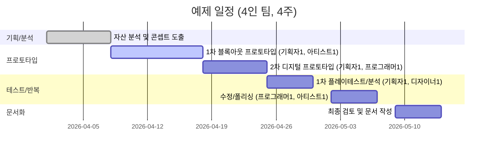

# 1. 해야할 것

1. 게임산업 뉴스 읽기 
2. 개인 공부


# 2. 오늘 배운 것


<details>
<summary>접기/펼치기</summary>


# 요약 
표준화된 프랍과 액션-퍼즐 모듈을 활용한 예제 레벨 제작은 **자산 분석**→**목표 경험·학습 목표 정의**→**콘셉트 구상**→**프로토타입 제작**→**플레이테스트**→**반복 수정**→**최종 문서화**의 흐름으로 진행합니다. 먼저 기존 레벨과 프랍을 분류하여 기능과 메모리·퍼포먼스 특성을 분석합니다. 목표 플레이어 경험과 난이도 곡선을 설정하고 학습 단계를 단계별로 설계합니다. 핵심 게임 메커닉에 맞춰 브레인스토밍하고, 페이퍼·디지털·엔진 등 단계별 프로토타입을 신속 제작합니다. Unity ProBuilder 등 툴을 활용해 그레이박스(blockout) 단계부터 빠르게 테스트하며, **플레이테스트**를 통해 정성·정량 데이터를 수집합니다. 테스터 피드백을 반영해 난이도를 조정하고 게임피일·텔레그래핑·페이싱을 다듬어 마감합니다. 이 과정을 지원할 **문서·템플릿**(레벨 디자인 문서, 플로우차트, 인카운터 맵, 주석 스크린샷 등)을 준비합니다. 위험요소로는 범위 변화, 성능 한계, 플레이어 좌절도 등이 있으며, 조기 테스트와 데이터 기반 의사결정으로 대응합니다. 1~4인 소규모 팀의 예산과 일정도 제시합니다. 마지막으로, 단순·중간 복잡도의 예제 레벨 2개를 레이아웃 스케치(ASCII)와 튜닝 제안과 함께 설명합니다. 

## 1. 자산 분석 및 핵심 요소 추출  
- **에셋 목록 작성**: 제공된 레벨과 프랍 목록을 테마·기능별로 분류합니다. 예를 들어, 장애물(가시, 문), 기믹(버튼, 스위치), 트랩(움직이는 블럭) 등으로 구분합니다. 각 프랍의 **용도**와 **주요 게임 메커닉**(점프, 이동, 상호작용 등)을 파악합니다.  
- **퍼포먼스·최적화 분석**: 프랍이 차지하는 메모리와 연산을 검토합니다. 동일한 프랍을 복제해 배치해도 메모리에는 1개만 로드되므로【7†L88-L90】, 가능한 한 공통 프랍 사용을 권장합니다. 복잡한 모델은 카메라·충돌용 단순 충돌 메시(colliders)로 대체하고, 거리 레벨(LOD) 등을 고려합니다.  
- **모듈 기준 정의**: 모듈식 설계를 위해 키트(테마별 모듈 집합), 모듈(배치 단위) 등을 정의합니다【48†L41-L44】. 각 모듈의 **범위(Foot Print)**와 **피봇**을 정하고, 문/창문 등 접속 부분의 규격(spec)을 통일합니다【48†L41-L44】【48†L78-L86】. 이를 통해 다양한 조합과 재사용이 가능해집니다.  
- **핵심 요소 도출**: 위 분석을 통해 반복 사용하는 에셋(예: 이동 플랫폼, 눌러야 열리는 문, 적 배치 패턴 등)과 메커닉의 반복 유형(숫자, 위치, 패턴 등)을 뽑아냅니다. 예를 들어, 유사 적 배치라도 밀도·위치·높이 변화로 새로운 경험을 제공할 수 있습니다【3†L50-L58】【3†L110-L118】.  

## 2. 플레이어 경험 목표·학습 목표·난이도 곡선  
- **플레이어 경험 정의**: 설계 목표(도전감, 탐험/발견, 스토리 연계 등)를 명시하고, 타겟 유저층(초보자 vs 숙련자, 연령대 등)에 맞는 경험을 설정합니다. 게임 속도감, 주인공 능력, 환경 분위기 등을 고려해 **감정 기복**(흥분-안정-성취 등)을 설계합니다. 예를 들어 퍼즐 중심 레벨이라면 *성취감*과 *논리적 만족*을, 액션 중심 레벨은 *몰입감*과 *긴장감*을 강조합니다.  
- **학습 목표 설정**: 각 레벨에서 플레이어가 익히게 될 메커닉과 순서를 정의합니다. 예를 들어 첫 레벨에서 단순 버튼 조작을 가르치고, 이후 레벨에서는 버튼과 이동 플랫폼을 조합한 복합 도전을 단계적으로 제시합니다. 이를 통해 플레이어가 자연스럽게 새로운 기능을 학습할 수 있도록 합니다.  
- **난이도 곡선 디자인**: 전반적인 난이도 상승 그래프를 계획합니다. 초반부는 쉬운 도전(예: 기본 점프 연습)으로 자신감을 쌓게 하고, 후반부로 갈수록 난이도를 높여야 합니다. 좋은 난이도 곡선은 플레이어가 ‘불가능하게 느껴지지 않으면서도 계속 도전하게 하는’ 자연스러운 상승 구조를 가져야 합니다【28†L241-L243】. 연구에 따르면 학습과 몰입에 최적인 실패율은 약 15% 정도(성공율 85%) 수준이다【23†L140-L148】【22†L113-L120】. 즉, 플레이어가 어느 정도 도전감을 느끼되 지나치게 막히지 않도록, 실패 횟수가 전체의 15% 내외가 되도록 레벨을 튜닝하는 것이 효과적입니다. 
- **난이도 측정 방법**: 테스트를 통해 **소요 시간**, **실패 횟수**, **클리어율** 등 정량 데이터를 수집합니다. 예를 들어, 원하는 실패율을 조정하거나 특정 구간의 체감 난이도를 묻는 설문을 활용합니다. 또한 플레이어 인터뷰나 행동 관찰을 통해 정성적 피드백을 수집하여 난이도 과·저점을 파악합니다. 이를 기반으로 체크포인트 배치, 플랫폼 크기, 이동속도 등을 조정합니다. 

## 3. 레벨 콘셉트 아이데이션 
- **브레인스토밍**: 핵심 메커닉과 자산 분석 결과를 바탕으로 자유로운 아이디어를 발상합니다. 예를 들어 “(이동 플랫폼) + (적 패턴)” 혹은 “(상자 밀기) + (압력판)” 같은 조합을 떠올리고, 종이 위에 기본적인 구조를 그려봅니다. 게임의 스토리나 테마와 연계되는 아이디어도 동시에 고려합니다.  
- **3막 구조 사용**: 레벨 진행을 ‘도입→전개→클라이맥스’로 나눠 생각합니다. 도입부에서 기본 동작을 소개하고, 전개부에서 약간의 변형과 복합적 도전을 주며, 클라이맥스에서 중요한 보상/목표를 제시합니다. 예를 들어, 액션게임 레벨에서는 중간에 짧은 휴식구간(쉬운 적 배치)과 마지막 보스 영역을 둡니다.  
- **스케치와 컨셉 도출**: 종이나 화이트보드에 핵심 아이디어를 스케치합니다. 시작지점과 목표, 주요 장애물/장치(압력판, 문, 이동 플랫폼 등) 위치를 대략적으로 배치합니다. 예를 들어 퍼즐 레벨이라면 상자와 스위치의 초기 위치를, 액션 레벨이라면 주요 적의 순찰 경로와 엄폐물 위치를 그립니다.  
- **기능 연관성 강조**: 아이디어가 각 프랍의 기능을 잘 활용하고 있는지 검토합니다. 예를 들어 움직이는 플랫폼은 점프 난이도 조절, 스위치는 논리 퍼즐 기능, 적은 학습된 행동을 테스트하는 수단이 되어야 합니다. 중복 기능을 줄이고, 핵심 메커닉이 계속 반복 노출되도록 하여 플레이어가 해당 메커닉에 익숙해지게 합니다.  

## 4. 프로토타입 워크플로우 
- **페이퍼 프로토타입**: 초기 단계에서는 종이 모형이나 간단한 드로잉을 사용해 아이디어를 빠르게 검증합니다. 예를 들어 맵 종이에 플레이어·상자 마커를 놓고 이동 경로를 시뮬레이션하거나, 카드보드로 이동 플랫폼 모형을 만들어 간단히 테스트할 수 있습니다. 비용이 적고 빠르게 변경할 수 있어 초기 개념에 유용합니다.  
- **디지털 그레이박스(화이트박스)**: 이후 디지털 툴에서 블록아웃(blockout)을 진행합니다. Unity ProBuilder【51†L102-L104】, Unreal Engine의 브러시, Godot의 GridMap 등을 이용해 간단한 박스 형태로 맵을 제작합니다. 이 단계에서는 색상·텍스처·아트워크는 최소화하고 공간 배치와 플레이 구조만을 확인합니다. ProBuilder는 에디터 내에서 즉시 레벨 지오메트리를 만들고 테스트할 수 있어 **빠른 프로토타이핑**에 유용합니다【51†L102-L104】.  
- **엔진 통합 프로토타입**: 실제 사용할 엔진(또는 범용 엔진)을 선택해 프로토타입을 제작합니다. 위에서 만든 그레이박스 맵을 해당 엔진으로 옮기고, 표준 애셋(이동 플랫폼 모션, 문 열림 이벤트, 적 AI 등)을 추가합니다. 이 단계에서는 실제 조작감(플레이어 이동 속도, 점프 거리 등)과 UI(힌트·체력바)를 테스트할 수 있습니다.  
- **에셋 재사용 전략**: 표준화된 프랍들은 가능한 한 **프리팹(prefab)** 형태로 재사용합니다. 예를 들어 공통 프로토타입 블럭(바닥, 벽, 플랫포머)과 로직(스위치, 트랩 등)을 미리 정의해 두고, 이를 조합해 레벨을 만듭니다【13†L25-L29】【48†L129-L130】. 이렇게 하면 수정이 필요할 때 한 번의 변경으로 전 레벨에 적용되어 효율적입니다.  
- **시간 추정**: 한 프로토타입 반복(iteration)은 규모에 따라 다르나, 보통 **1회당 1~3일** 정도를 가정합니다. 작은 레벨은 하루, 중간 레벨은 2~3일 정도로 계획할 수 있습니다. 초기 블록아웃에 1~2일, 엔진 구현과 간단한 테스트에 1일 정도가 소요됩니다. 이후 플레이테스트 결과에 따라 수정에 1일가량 추가 투자합니다. 

## 5. 플레이테스트 디자인  
- **목적과 참가자**: 플레이테스트의 주요 목적(난이도 평가, 재미도 측정, 버그 탐지 등)을 정합니다. 타겟 플레이어(예: 게임 장르 경험자, 연령대)를 고려해 테스트 대상을 선정합니다. 새 유저와 기존 숙련자를 적절히 섞어 다양한 피드백을 얻는 것이 좋습니다.  
- **측정 지표(메트릭)**: 정량적 데이터로는 **클리어 성공율, 플레이 시간, 오류/사망 횟수, 장애물 도달/실패 위치** 등을 기록합니다. 정성적 데이터로는 **설문조사, 인터뷰, 행동 관찰**을 실시합니다. 플레이어가 어떤 부분에서 당황했는지, 어떤 피드백을 주었는지를 체계적으로 메모합니다.  
- **테스트 스크립트 및 시나리오**: 테스트 전에 스크립트(테스트 플랜)를 준비합니다. 예를 들어 “목표는 X까지 도달하기”와 같은 명확한 과업을 제시하고, 필요한 최소한의 조작 설명을 제공합니다. 실습 전에 간단한 튜토리얼 또는 시연을 해주고, 플레이 중에는 말을 최소화해 자연스러운 반응을 유도합니다. 각 세션은 녹화하거나 진행자가 동행하며 메모합니다.  
- **세션 템플릿**: 테스트 기록용 템플릿에는 시작 전 목표 설명, 플레이어 프로필(경험 수준), 진행 시간 기록란, 주요 문제점 체크리스트 등을 포함합니다. 예를 들어 “플레이 시작/종료 시간, 특정 장애물 도달 시도 수, 플레이어 감상(자유 서술)” 항목 등을 만듭니다. 이때 **개방형 질문**(어려웠던 점, 재미있었던 부분)과 **척도형 질문**(난이도 평가 1~5 등)를 섞어 피드백을 받습니다.  
- **분석 방법**: 데이터를 수집 후 그래프로 시각화하거나 표로 정리하여 문제 구역을 파악합니다. 통계적으로 오류가 많이 발생한 구간, 평균 플레이 시간을 중간값과 비교, 자주 실패한 지역 등을 점검합니다. 또한 정성적 피드백을 카테고리화하여 개선 필요 영역(인지성, 조작감, 시각적 힌트 등)을 도출합니다. 예: 메쉬 AI 가이드에 따르면, 테스터가 예상 외의 지점에서 막히면 “수정 신호”로 판단해야 한다고 강조합니다【28†L247-L253】【45†L1-L4】. 특히 “피드백은 금”이므로 테스터가 어려워한 부분은 반드시 주의 깊게 분석해야 합니다【45†L1-L4】. 

## 6. 반복 및 폴리시 체크리스트  
- **반복 프로세스**: 플레이테스트 결과를 바탕으로 문제를 수정하고, 수정된 버전을 재테스트하는 루프를 반복합니다. 특히 레벨의 흐름(flow)을 의식하며, **아이템 획득 경로, 플랫폼 점프 연속성, 적 배치 리듬** 등이 자연스럽게 연결되도록 합니다.  
- **게임 피드백(Feel) 개선**: 캐릭터의 조작감(이동/점프의 부드러움), 카메라 워크, 이펙트(충돌 시 효과음 등) 등을 점검하여 게임의 체감 만족도를 높입니다. 예: 점프감이 묵직하면 점프력을 약간 조정하고, 성공 시 시각적·청각적 피드백을 추가합니다.  
- **행동 예고(Telegraphing)**: 플레이어가 다음 행동을 예상할 수 있도록 시각적 신호를 줍니다. 예를 들어 떨어질 발판 위에 전조 효과(흔들림, 스파크)를 주거나, 적이 발사 전 동작을 크게 하는 등으로 “다음 위험”을 미리 암시합니다. 이는 조작의 공정성을 높이고 난이도를 조절하는 데 중요합니다.  
- **페이싱(Pacing) 관리**: 레벨 내 도전 구간과 휴식 구간의 균형을 맞춥니다. 연속된 고난이도 구간 후에는 비교적 쉬운 탐색 구간(예: 단순 이동)이나 보상을 두어 플레이어가 긴장을 풀 수 있게 합니다. 이는 앞서 말한 **난이도 곡선**을 완만하게 만들고 플레이어 피로도를 줄입니다.  
- **접근성 점검**: 컬러블라인드, 오디오 볼륨, 조작 난이도(버튼 조합 수) 등 접근성 요소를 고려합니다. 예를 들어 색으로만 구분되는 장치는 텍스처나 패턴 보조를 추가하고, 난이도 선택 기능(이동 속도 감소, 힌트 추가 등)을 제공할 수도 있습니다.  
- **버그 트라이아지(Bug Triage)**: 발견된 버그는 심각도(진행 불가, 그래픽 글리치 등)에 따라 분류합니다. 즉시 수정할 이슈와 후순위로 미룰 이슈를 구분하고, 각 이슈별로 담당자를 지정합니다. 플레이 반복 중 사소한 문제(예: 간헐적 충돌 이펙트 미노출)는 폴리시 단계에서 정리하고, 게임플레이 주요 오류는 즉시 고칩니다.  
- **최종 점검**: 최종적으로 난이도 곡선과 레벨 흐름을 미세 조정하여 전체적으로 균형이 맞는지 확인합니다【28†L255-L257】. 조명·음향·배경음악 등을 조절해 분위기를 한층 살리고, 부자연스러운 레벨 요소(경로가 갑자기 끊기거나 너무 반복되는 부분)를 보완합니다. 작은 디테일(마커, 안내 표시, 장식 아이템)도 최종 몰입감에 큰 역할을 하므로 놓치지 말아야 합니다【28†L255-L257】. 

## 7. 문서화 템플릿 및 산출물  
설계 과정을 체계화하기 위해 아래와 같은 문서·템플릿을 준비합니다.  

|문서/자료|내용 요약|추천 형식|
|:---|:---|:---|
|**레벨 디자인 문서**|목표 경험·학습 목표, 레벨 개요, 난이도 곡선, 핵심 메커닉/프랍 리스트, 예시 동선(Flow) 등. 주요 장면마다 개념 스케치와 설명 포함.|Markdown/PDF/Word (편집 가능 폼).|
|**플로우차트(흐름도)**|레벨 내 이벤트 흐름(예: 스위치→문 열림), 상태 전환, 사용자 선택 분기 등을 시각화. 프로그래밍 로직 등도 포함 가능.|SVG/PNG (가독성 위해 벡터 권장). Mermaid 코드로도 생성 가능.|
|**인카운터 맵(적 배치도)**|맵 상의 적·장애물·기믹 위치를 도식화. 동선 및 시야 표시(시야각, 순찰 경로)와 함께 각 배치의 의도를 주석.|PNG/JPEG (일러스트레이터 파일 가능).|
|**주석 있는 스크린샷**|중요 구간의 스크린샷에 메모 삽입(예: A 지점에는 ~하여 유도). 레벨을 설명하는 비주얼 레퍼런스 역할.|PNG/JPEG (이미지 편집 프로그램).|
|**튜닝 파라미터 표**|문자 정보로 표현 어려운 밸런스 값(적 HP, 데미지, 시간 제한 등)을 표로 정리.|CSV/Google Sheets/Excel (공유 및 수정 용이).|
|**이슈·개선 요청 테이블**|플레이테스트에서 나온 문제와 수정 요구사항을 정리. 우선순위, 담당자, 상태를 기재.|Spreadsheet (Google Sheets 등 협업 문서).|

이 외에도 회의록, 간트차트 같은 추가 문서를 프로젝트 규모에 맞게 생성할 수 있습니다. 중요한 점은 **모든 문서는 누구나 쉽게 확인·수정**할 수 있는 형식으로 관리하는 것입니다.  

## 8. 위험 요소 및 대응 전략  
- **범위 증가(Scope Creep)**: 초기 기획에 없는 기능 추가 요구나 레벨 확대가 발생할 수 있습니다. 이를 방지하려면 기획 단계에서 **MVP(minimum viable product)**를 설정하고, 모든 아이디어는 우선 목록에 올린 뒤 핵심 검증 후 가능 여부를 논의합니다. 또한 일정에 여유 분을 둡니다.  
- **기술·퍼포먼스 한계**: 복잡한 레벨이나 리소스 집약적 프랍 사용 시 기기 성능이 부족할 수 있습니다. 대응책으로는 프롭 폴리곤 수·텍스처 해상도 절감, 그림자·이펙트 과다 사용 자제 등을 미리 검토합니다. 프로파일러를 사용해 병목을 분석하고, 모바일·저사양 테스트를 별도로 진행합니다.  
- **플레이어 좌절/지루함**: 난이도 조정 실패로 플레이어가 너무 쉽게 느끼거나 반대로 너무 어려워 이탈할 수 있습니다. 첫 테스트에서 주요 문제를 잡아내고, 언제나 적절한 실패율(≈15%)을 유지하도록 조정합니다【23†L140-L148】【28†L241-L243】. 휴식 요소가 부족할 경우 지루함을 호소할 수 있으니 전투/퍼즐/탐색의 비중을 조절합니다.  
- **의사소통 오류**: 다수의 문서와 프로토타입이 생성되므로 팀원간 정보 불일치가 발생할 수 있습니다. 이를 방지하려면 문서 통일 포맷을 미리 정하고, 변경 시 항상 버전 관리를 합니다. 주요 업데이트는 회의나 슬랙 등으로 공유하여 인지 차단을 막습니다.  
- **일정 지연**: 예상보다 계획이 길어질 수 있습니다. 일정은 여유시간을 포함해 잡고, 마일스톤마다 진행도를 점검합니다. 중간점검 미팅을 통해 진행 상황을 모니터링하고, 위험 신호(지연 발생, 버그 증폭 등)가 감지되면 우선순위를 재조정합니다.  

## 9. 예산/일정 및 리소스 배분 예시  
작은 팀(1~4인)의 사례를 가정해 예시 일정을 작성합니다. 작업 항목과 인시(人時)를 참고하여 **간트 차트** 형태로도 나타낼 수 있습니다. 예:



*표 1. 예시 일정표:* 4주간 주요 단계 및 팀원 배치, 소요 기간 예시  

또한 단계별 리소스(인원) 할당 예시: 
- **주 1~2주:** 기획자1(콘셉트·설계), 아티스트1(블록아웃 모델링), 프로그래머1(엔진 블록인)
- **3주:** 테스터 2~3명 동원하여 플레이테스트(기획자 주도), 기획자/개발자 필드수집
- **4주:** 기획자1·프로그래머1이 수정 및 최종 조정, 기획자·테스터가 피드백 공유 및 문서 완성  

실제 시간 환산: 전체 약 3,200인시(총 4인×4주×8h) 정도로, 중요한 마일스톤(프로토타입, 플레이테스트, 최종 제출)을 명확히 잡고 각 마감 전 진행율을 점검합니다.  

## 10. 예제 레벨 시나리오  
아래는 표준 프랍을 활용한 **간단한 레벨 예시 2개**입니다. 각 예시에는 레이아웃 스케치(ASCII), 목적, 예상 경로, 난이도 진행, 튜닝 요소를 제시합니다.

**예제 1: 단일 챌린지 퍼즐 레벨 (초급)**  
- **목적**: 문을 열기 위해 중앙의 플랫폼 위 스위치를 눌러야 함. 상자는 버튼 고정용.  
- **레이아웃 (ASCII)**: 
  ```
  [시작]─┐
         ▼
      +-----+
      |  P  |  ← 압력판 (스위치)
      +--+--+
         |
        [B]   ← 상자 위치
  ```
  - 플레이어는 시작 지점에서 가로로 이동하여 중앙 방으로 진입합니다.  
  - 중앙의 압력판(P)은 플레이어가 서 있기만 해도 문이 열리기에는 짧은 시간입니다. 상자(B)를 옮겨 올려놓아야 회로가 유지됩니다.  
  - 상자를 미는 경로에는 가시 함정이 없지만 약간의 이동이 필요합니다.  
- **예상 경로**: 플레이어는 상자를 잡아당겨(?) 압력판 위로 민 다음, 뒤로 물러나 문이 열리는지 확인.  
- **도전 진행**: 처음에는 스위치를 직접 눌러보는 학습 단계를 거치고, 곧 상자를 옮기는 퍼즐로 확장됩니다.  
- **튜닝**: 압력판의 민감도(버튼 누름 판정 거리), 상자의 무게(한 번에 움직이는 거리), 문이 열리는 시간 등으로 난이도 조절 가능. (예: 플래이어 대기 시간 0.5초 → 1초 변경)  

**예제 2: 중간 난이도 액션+퍼즐 레벨**  
- **목적**: 왼쪽 끝의 열쇠(키) 수집 후 우측 문을 열고 탈출. 도중에 회전하는 블레이드 함정 피해야 함.  
- **레이아웃 (ASCII)**: 
  ```
  [S]──┬─────┐
        │     ▼
   ┌───+▲+──┐│
   │ 블레이드 ││
   └┬──+ +───┘│
    │  ▲  [K]│
    │  ▲     ▼
   [   ]───[D]→ [탈출]
   (상자)      
  ```
  - S: 시작, ▲: 회전 블레이드 함정, [K]: 열쇠 아이템, [D]: 잠긴 문, [ ]: 밀 수 있는 상자(압력판 대용).  
  - 플레이어는 시작 후 오른쪽으로 이동하여 회전 함정을 피해 키(K)를 획득해야 합니다.  
  - 회전 블레이드(▲)는 왼쪽-오른쪽 순찰하므로 타이밍이 중요합니다.  
  - 키를 얻은 후 돌아오는 길에 상자를 압력판처럼 사용해 잠긴 문 앞의 센서를 활성화해야 문이 열립니다.  
- **예상 경로**: (1) 함정 피하기 학습 → (2) 열쇠 획득 → (3) 상자 끌기 → (4) 문 열기 및 탈출.  
- **난이도 진행**: (1) 함정을 피하면서 키 위치까지 간단한 액션, (2) 상자 이동 퍼즐 요소 추가, (3) 마지막 탈출 타이밍을 요구.  
- **튜닝**: 블레이드 속도(느리게→빠르게), 키 획득 후 문이 닫히는 시간, 상자 무게 등을 조절. 예를 들어 블레이드 속도를 느리게 하면 복잡도 ↓, 빠르게 하면 타이밍 난이도 ↑.  

이와 같이 **프랍 조합**과 **플레이어 경로**를 구체화하여 레벨을 설계합니다. 각 요소(상자, 함정, 문 등)의 파라미터를 조정하며 난이도를 미세 조절할 수 있습니다. 

---

**다음 단계에 대한 질문 예시**:
1. 제공된 표준 프랍/모듈 외에 새로 추가하거나 수정할 요소가 있나요?  
2. 목표로 하는 플레이어(연령, 숙련도)에 맞춰 난이도나 학습 단계를 어떻게 조정할까요?  
3. 프로토타입 제작 시 우선 순위로 사용하고 싶은 툴이나 엔진은 무엇인가요? 사용 가능한 툴을 알려주세요.  
4. 일정 및 리소스가 부족해질 경우, 어떤 요소를 절충할 수 있을까요? (예: 세부 그래픽 vs 테스트 시간)

</details>


# 3. 개선


<details>
<summary>접기/펼치기</summary>


</details>


# 4. 생각


